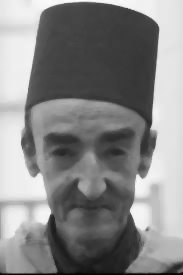
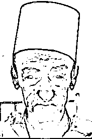
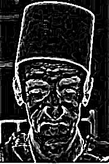
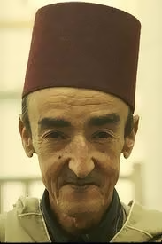
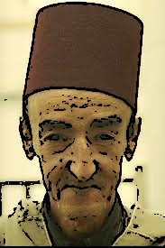
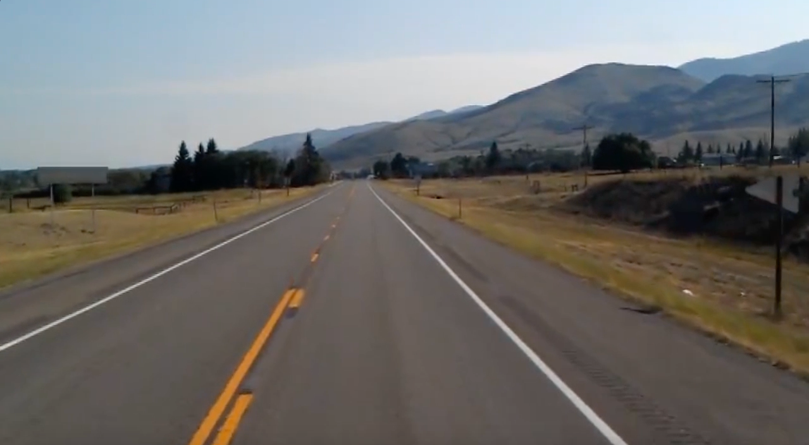
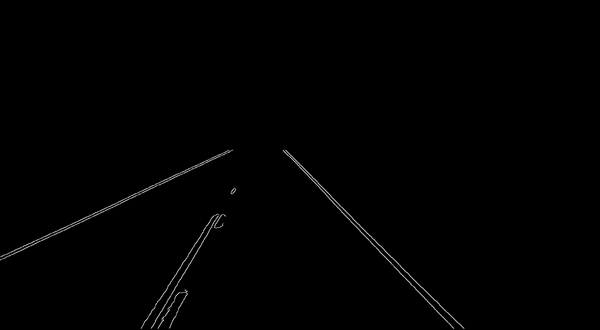
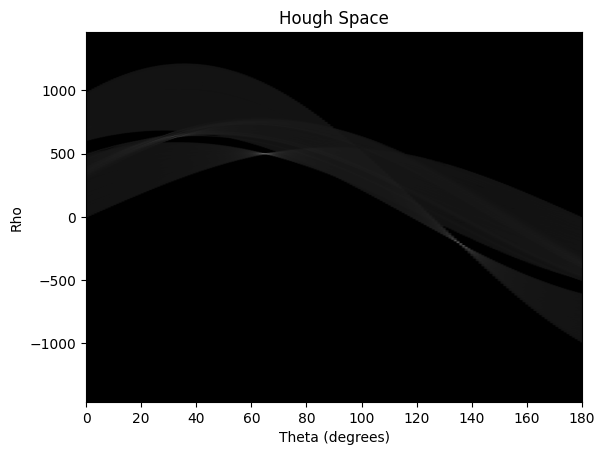

# Part I: Image Cartoonifying

This part explores using various image processing filters to transform real-world images into a cartoon-like style.

## Key Steps

* **Black and White Sketch:**
    * **Noise Reduction:** Median filter cleans the image.
    * **Edge Detection:** Laplacian filter identifies edges, converted to black/white using thresholding.
* **Color Painting:**
    * **Bilateral Filtering:** Smooths flat regions while preserving edges.
    * **Optimization:** Apply smaller, truncated filters for efficiency and similar effect.
* **Cartoon Creation:**
    * Overlay the black and white sketch onto the color painting, preserving edges and creating the cartoon effect.

## Results

    

    <em>Original Image</em>

    

    <em>Noise Reduction</em>

    

    <em>Edge Detection</em>

    

    <em>Thresholding</em>

    

    <em>Smoothing</em>

    

    <em>Cartoonified</em>

# Part II: Road Lane Detection with Hough Transform

This part explores using the Hough Transform to detect road lanes within an image.

## Key Steps:

* **Image Preprocessing:**
    * **Smoothing:** A 2D median filter removes noise.
    * **Edge Detection:** Canny edge detection with high thresholds identifies strong edges.

* **Region of Interest (ROI):**
    * A defined polygon masks irrelevant edges, focusing on the potential road area.

* **Hough Transform:**
    * Accumulates votes for potential line parameters (ρ, θ) based on edge points.
    * Identifies peaks in the accumulator array as likely lane lines.

* **Refinement:**
    * Non-maximum suppression removes weaker lines close to stronger ones.

## Results:

    

    <em>Original Image</em>

    

    <em>Masked Edges</em>

    

    <em>Accumulator array</em>

    

    <em>Road with lanes</em>

